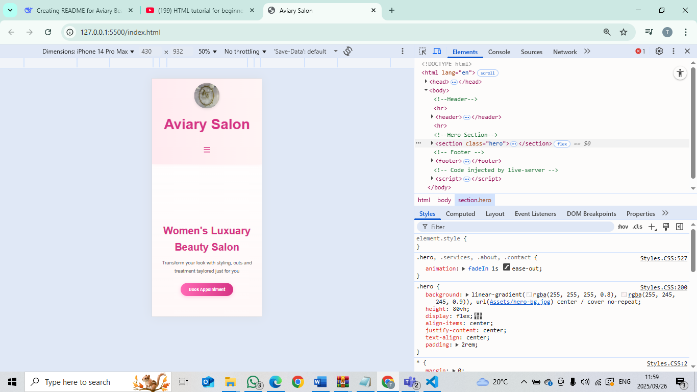
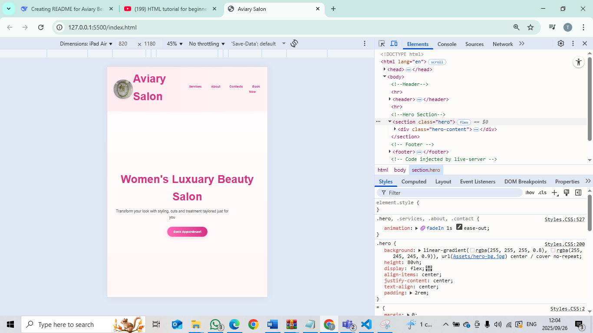

 Aviary Women's Beauty Salon Website

A modern, responsive website for Aviary Beauty Salon built using HTML, CSS, and JavaScript. This static website showcases the salon's services, about information, contact details, and booking functionality with an elegant, feminine design.

 Features

Fully Responsive Design - Optimized for both desktop and mobile devices
Interactive Navigation  - Hamburger menu for mobile with smooth animations
Service Gallery         - Visual showcase of hair, nails, and lashes services
Booking System          - Simple appointment booking form
Google Maps Integration - Location mapping for easy directions
Modern UI/UX            - Gradient backgrounds, hover effects, and smooth transitions
Fast Loading            - Static website with no server dependencies

File & Folder Structure

AviarySalon/
│
├── Pages/
│ ├── about.html    - About page with salon information
│ ├── contact.html  - Contact page with map and details
│ ├── services.html - Services gallery page
│ └── booking.html  - Appointment booking form
│
├── css/
│ └── styles.css    - Main stylesheet with all styling
│
├── assets/
│ └── images/       - All website images (logo, service photos, etc.)
│
└── index.html      - Homepage (main entry point)

Installation & Setup

Option 1: Local Development
1 Download or clone this repository
2 Open index.html in any modern web browser
3 No server setup required - works as a static website

Option 2: Web Hosting
1 Upload all files to your web hosting service
2 Ensure file structure is maintained
3 Website is ready to use immediately

Dependencies

Font Awesom     - For elegant icons throughout the site
Google Fonts    - Poppins font family for modern typography
Google Maps API - For embedded location map (free tier)

Customization

Content Updates
- Edit HTML files in the Pages/ directory to update text content
- Modify index.html for homepage changes
- Update service images by replacing files in assets/images/

Styling Changes

- Edit css/styles.css to modify colors, fonts, or layout
- Primary brand color: #d63384 (pink)
- Secondary colors: #ff69b4 , #ffc2d6, #fff5f5

Adding New Pages

1. Create new HTML file in Pages/ directory
2. Update navigation in all HTML files
3. Add corresponding CSS styles in styles.css

Browser Compatibility

Chrome 60+
Firefox 55+
Safari 12+
Edge 79+
Mobile browsers (iOS Safari, Chrome Mobile)

Author

*Tshepi Sebetwa* 
*Web Developer & Designer

Changelog

Current Version (2025-09-26)
Enhanced mobile responsiveness with improved hamburger menu
Added service gallery with hover effects and animations
Integrated Google Maps for location display
Improved styling with gradient backgrounds and shadows
Added booking form with responsive table layout
images and loading performance

Initial Release (2025-08-27)
Basic website structure with homepage and navigation
About page with salon information and owner profiles
Contact page with basic information
Responsive foundation for mobile compatibility
Initial styling with color scheme and typography

References

W3Schools. (2025). CSS Reference. Retrieved from https://www.w3schools.com/cssref/
(Code Code, 2023) 2 years ago. Retrieved from    https://www.youtube.com/watch?v=2oCN2q1x3c4&list=PLZPZq0r_RZOOxqHgOzPyCzIl4AJjXbCYt

License

This project is proprietary and belongs to Aviary Beauty Salon. All rights reserved.

For questions or support regarding this website, contact the development team or refer to the documentation above.

Screenshots 

